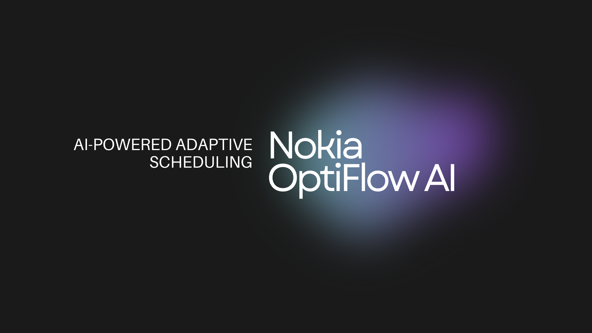

# 🚀 Nokia OptiFlow – AI-Powered Adaptive Scheduling and Resource Optimization

🔗 **Live Demo:** [Nokia OptiFlow Dashboard](https://nokia-opti-flow-5e11eed5.base44.app/Dashboard)

---

## 📖 Introduction

**Nokia OptiFlow** is an AI-driven production scheduling system developed for **Nokia Production Optimization**.  
It tackles the inefficiencies of **traditional static scheduling** by introducing **real-time, intelligent adaptive resource management**.  

The system improves **machine utilization (15–20%)**, reduces **workforce idle time (10%)**, and reallocates resources within **5 seconds** during disruptions.

---

## ⚡ Features

- **Intelligent Forecasting** – Demand prediction using Prophet/LSTM  
- **Adaptive Scheduling Core** – Combines constraint optimization with reinforcement learning  
- **Real-Time Reallocation** – Automatic rescheduling for machine failures, absences, or urgent jobs  
- **Interactive Dashboard** – Gantt charts, KPIs, alerts, and report exports  
- **Multi-Shift & Skill-Based Scheduling** – Matches worker skills with machine capabilities  
- **Scalable & Reliable** – Handles 10× job volume without performance drop  

---

## 🏗️ Architecture

- **Frontend:** React, TailwindCSS, Recharts  
- **Backend:** Python,Prophet, Stable-Baselines3 (RL)  
- **Deployment:** Base44 Hosting  
- **Visualization:** Gantt Charts, KPI Panels, Alerts  

---

## ⚙️ Installation (Local Setup)

> Requires **Python 3.9+** and **Node.js** (if building the React dashboard).

### Clone the repository

git clone https://github.com/<your-username>/Nokia-Optiflow.git
cd Nokia-Optiflow

##Install Python dependencies
pip install -r requirements.txt

##Run the backend
python main.py

##Build and run the React dashboard
cd dashboard
npm install
npm start

## 🚀 Usage

### 1. Prepare input files (CSV/Excel/JSON) containing:
- **Job queue:** `JobID, ProcessingTime, Deadline, Priority`
- **Machine list:** `MachineID, Capacity, Status`
- **Worker data:** `WorkerID, Skill, Availability`

### 2. Upload data through the dashboard
- Navigate to the upload section and select the prepared files.

### 3. Generate the schedule
- View allocations on the **interactive Gantt chart**.

### 4. Simulate disruptions
- Example: mark a **machine down** or a **worker absent**.  
- Watch **real-time rescheduling** happen instantly.

### 5. Export reports
- Download daily/weekly reports in **CSV/PDF** format.

---

## 📊 Results

- **Machine Utilization:** +15–20%  
- **Workforce Idle Time:** –10%  
- **Disruption Handling:** < 5 sec reallocation  
- **Scalability:** 10× job volume supported  

---

## 🤝 Contributing

Contributions are welcome! 🎉  

To contribute:  
1. **Fork** the repo  
2. **Create** a new branch (`feature/your-feature`)  
3. **Commit** your changes  
4. **Push** to your branch  
5. **Open** a Pull Request  

---

## 📜 License

This project is licensed under the **MIT License**.  
See the [LICENSE](LICENSE) file for details.  

---

## 🌟 Acknowledgments

- Developed as part of the **Nokia Production Optimization Hackathon**  
- Thanks to mentors, organizers, and **Nokia** for the opportunity  
- Inspired by the vision of **Industry 4.0 smart manufacturing**  

